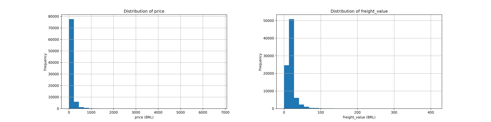
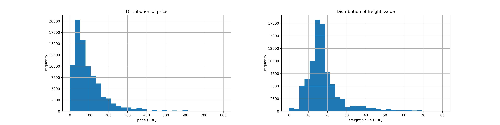

# Verify Data Quality

This step is used to identify data quality issues and assess how clean the data is before preparing it for modeling.

## Missing Value

There are missing values in the following variables: `product_weight_g` (1), `product_length_cm` (1), `product_height_cm` (1), `product_width_cm` (1), `order_approved_at` (12), `order_delivered_carrier_date` (849), and `order_delivered_customer_date` (1851).

Out of a total of 86066 order items, there are 2716 missing values, mainly in `order_delivered_carrier_date` and `order_delivered_customer_date`.

## Duplicates and Uniqueness

No duplicate order items were found, and no additional order items were introduced during the merging process.

## Ranges and Invalid values

The number of outliers with price greater than 800 BRL or freight value greater than 80 BRL is 1522.

The distribution of price shows that most order items are concentrated between 0 and 400 BRL.

The distribution of freight value shows that most order items are concentrated between 0 and 50 BRL.
